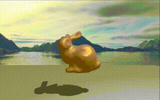
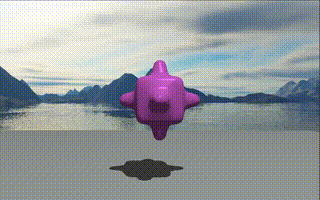
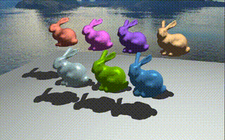

Fall 2021 CS-GY 6533, Introduction to Computer Graphics

Professor Claudio Silva

Submission for __Russell Wustenberg (rw2873)__

---

---
#Assignment 4: Extension of a 3D scene editor

## Table of Contents
[Acknowledged Faults](#acknowledged-faults)
1. [Command List](#command-list)
   1. [Camera Commands](#camera-commands)
   2. [Object Commands](#object-commands)
   3. [Color Manipulation](#color-manipulation)
   4. [Material Commands](#material-commands)
   5. [Lighting Commands](#lighting-commands)
2. [A Simple Test Scene](#a-simple-test-scene)
3. [Blinn-Phong Lighting and Shading](#blinn-phong-lighting-and-shading)
   1. [Phong Model for shading and Lighting](#phong-model-for-shading-and-lighting)
      1. [Color Due to Ambient Light](#color-due-to-ambient-light)
      2. [Color Due to Diffuse Light](#color-due-to-diffuse-light)
      3. [Color Due to Specular Light](#color-due-to-specular-light)
   2. [Blinn's Modified Phong Model](#blinns-modified-phong-model)
4. [Shadow Mapping](#shadow-mapping)
   1. [Shadow Highlighting](#shadow-highlighting)
   2. [Self-Shadowing](#self-shadowing)
   3. [Object-on-Object Shadowing](#object-on-object-shadowing)
5. [Environment Mapping](#environment-mapping)
   1. [Skybox Projection](#skybox-projection)
   2. [Reflection Capture](#reflection-capture)
6. [Camera Control](#camera-control)
   1. [Toggling Camera Type](#toggling-camera-type)
   2. [Camera Translating Up](#camera-translating-up)
   3. [Camera Translating Down](#camera-translating-down)
   4. [Camera Translating Right](#camera-translating-right)
   5. [Camera Translating Left](#camera-translating-left)
   6. [Camera Zooming In](#camera-zooming-in)
   7. [Camera Zooming out](#camera-zooming-out)
7. [Object Manipulation](#object-manipulation)
   1. [Object Insertion](#object-insertion)
      1. [Inserting a Cube](#inserting-a-cube)
      2. [Inserting a Bumpy Cube](#inserting-a-bumpy-cube)
      3. [Inserting a Bunny](#inserting-a-bunny)
      4. [Inserting a Plane](#inserting-a-plane)
   2. [Object Translation](#object-translation)
      1. [X-Dimension Translation](#x-dimension-translation)
      2. [Y-Dimension Translation](#y-dimension-tranlation)
      3. [Z-Dimension Translation](#z-dimension-translation)
   3. [Object Rotation](#object-rotation)
      1. [X-Dimension Rotation](#x-dimension-rotation)
      2. [Y-Dimension Rotation](#y-dimension-rotation)
      3. [Z-Dimension Rotation](#z-dimension-rotation)
   4. [Scaling](#scaling)
   5. [Color Cycling](#color-cycling)
      1. [Cycling Material Color](#cycling-material-color)
      2. [Cycling Light Color](#cycling-light-color)
   6. [Object Deletion](#object-deletion)
      1. [Stack Delete](#stack-delete)
      2. [Selective Delete](#selective-delete)

----

## Acknowledged Faults

At the start of my README for assignment 3, I enumerated a number
of known bugs in the submission.  Some of these are carried over as a legacy.

* The camera must be in its initial position for picking to work.  Reset with `R`.
  * After speaking with Ken Chen (TA), I believe that this issue is due to a logical
  bug more than an error in the code itself.  While I do perform the correct sequence
  of affine transformations to adjust the coordinate systems, I believe that I am either
  working in the wrong coordinate space for the testing (which is done in model space)
  or am failing to properly orient the ray itself.  The next step in debugging this code
  would be to draw the rays themselves into the scene and analyze their behavior. I am
  postponing this until after the course has completed, as it does not prevent functionality
  of the program.
* The cube mesh has misalgined normals.
  * Due to either vertex wrapping or my normalization calculation, my cube has two of its eight
  normals which are misaligned.  This causes each triangular face to have a mis-alignment between
  the two triangles forming its quad.  This is most evident in the reflective mode where distortions
  are present.  In its current implementation, a fix would consist of manually adjusting vertex normals
  to align with the proper axis.  While this would resolve the visual bug, it would not solve the logical
  flaw in the program itself.  Since this is a piece of coursework, I chose to be graded on what I consider
  the more important component of the assignment: the algorithm itself.  If points were deducted for this
  in assignment 3, I hope that this acknowledgement on my behalf will preempt them being deducted again here.
* (FIXED) The lighting for the scene no longer is sent in as a static variable.
  * Since the assignment dealt with lighting models, the earlier static lighting feature was changed.
  In implementation, I opted for a non-decaying point light rather than implementing a specific light model.
  Since the scene only has one light, there are some visual anomalies that cause misbehavior.  Given the
  need for two shadow maps in the case of multiple lights, I opted for a simpler solution. One example of
  such an anomaly is that changing the light's color has a global impact on objects even on back-facing sides.
* Cubemap Corruption
  * I attempted to use a third-party cubemap generator (https://jaxry.github.io/panorama-to-cubemap/) to convert
  some HD panoramas into functional cubemaps.  Unfortunately, they both turned out corrupted.  The images themselves
  both appear as, curiously, one can actually see a Bayer filter in their output!  I have left both in the
  current implementation, since they do load properly, but hope someday to resolve this issue.  For fun, try putting
  a reflective bunny into the scene with these cubemaps.  The result is [quite interesting](fails/moire_rabbit.png)!
---
[top of page](#table-of-contents)

## Command List
Below is a full list of commands relevant to operation of this program.  Where
relevant, links are provided to quickly view expected behavior.

### Camera Commands

|Key|Effect|
|:---:|:---|
|`W`| Translate camera up compared to its relative position.|
|`A`| Translate the camera left compared to its relative position.|
|`S`| Translate the camera down compared to its relative position.|
|`D`| Translate the camera right compared to its relative position.|
|`+`| Zoom camera in.|
|`-`| Zoom camera out.|
|`TAB`| Toggle between perspective and orthographic mode.|

[top of page](#table-of-contents)

### Object Commands

#### Scene Commands

|Key|Effect|
|:---:|:---|
|`ESC`| Exit the program. |
|`T`| Loads or unloads the [test scene](#a-simple-test-scene).|
|`Z`| Switch between preset [skycubes](#environment-mapping).|

#### Object Insertion and Deletion

|Key|Effect|
|:---:|:---|
|`1`|Insert a cube into the scene.|
|`2`|Insert a bumpy cube into the scene.|
|`3`|Insert a bunny into the scene.|
|`4`|Insert a plane into the scene.|
|`BACKSPACE`|[Stack Deletion](#stack-delete).|
|`Delete`|[Selective Deletion](#selective-delete).|

#### Object Manipulation

All directions for object manipulation are along their model axes (not global axes).

|Key|Effect|
|:---:|:---|
|`LMB`| Click on an object to select it. |
|`U`| Translate the object in the positive X direction.|
|`SHIFT` + `U`|Translate the object in the negative X direction.|
|`I`| Translate the object in the postive Y direction.|
|`SHIFT` + `I`| Translate the object in the negative Y direction.|
|`O`| Translate the object in the positive Z direction.|
|`SHIFT` + `O`| Translate the object in the negative Z direction. |
|`J`| Rotate the object in the positive X direction. |
|`SHIFT` + `J`| Rotate the object in the negative X direction. |
|`K`| Rotate the object in the positive Y direction|
|`SHIFT` + `K`| Rotate the object in the negative Y direction. |
|`L`| Rotate the object in the positive Z direction.|
|`SHIFT` + `L`| Rotate the object in the negative Z direction. |
|`;`| Scale the object to be larger. |
|`SHIFT` + `;`| Scale the object to be smaller. |

[top of page](#table-of-contents)

### Color Manipulation

There are 8 preset colors in the scene.  Both materials and the light can be cycled
through these colors in sequence.  The preset colors are:

|<u>Color|Red | Green | Blue|
|:---:|:---:|:---:|:---:|
|__Gray__| 0.5 | 0.5 | 0.5 |
|__Cyan__| 0.66 | 0.9 | 0.96 |
|__Teal__| 0.11 | 0.45 | 0.96 |
|__Purple__| 0.3 | 0.1 | 0.7 |
|__Pink__| 0.86 | 0.14 | 0.82 |
|__Orange__| 0.86 | 0.43 | 0.2 |
|__Yellow__| 0.3 | 0.75 | 0.0 |
|__Green__| 0.6 | 0.81 | 0.7 | 

[top of page](#table-of-contents)

### Material Commands

All material manipulations require that the object be selected.
At object creation, the default color is gray.  Cycling through colors
will not include this gray in the cycle.  If you wish to reset the
color back to gray, you must have the object selected and hold `SHIFT`.

|Key|Effect|
|:---:|:---|
|`C`| Cycle the color of the selected object between 8 presets. |
|`X`| Toggle chrome material property. |
|`SHIFT` + `R`| If an object is selected, resets object color to gray. |
|`MOUSE SCROLL`| If object selected, increase / decrease the shininess coefficient. |

[top of page](#table-of-contents)

### Lighting Commands

|Key|Effect|
|:---:|:---|
|`~` | Toggle orbiting scene light movement.|
|`B`| Toggle between [Blinn-Phong](#blinns-modified-phong-model) and [Phong](#phong-model-for-shading-and-lighting) models. Default is Phong.|
|`SHIFT` + `C`| Cycle the color of the scene light between 8 presets. |
|`SHIFT` + `S`| Toggle shadow highlight.|
|`SHIFT` + `R`| If no object is selected, resets the light to default white.|
|`MOUSE SCROLL`| If no object selected, increase / decrease light movement speed. |

[top of page](#table-of-contents)

## A Simple Test Scene

If the user would like to quickly sample the visual aspects of the scene editor, they
can simply press `T` to generate a simple test scene.  If in the default position, the camera
will be quite close to the origin.  The user is encouraged to zoom out in order to take in the
whole of the scene.

Visible in this scene are the following features:
* Environment Mapping
* Object Manipulation
* Individual Object Colors
* Reflectance (on the floating bumpy cube)
* Shadow Mapping
* Dynamic Lighting

Please note, objects belonging to the default scene are not selectable. New objects can be
inserted into the scene if desired and manipulated as normal.

To toggle the test scene off, simply press `T` again.

[top of page](#table-of-contents)

## Blinn-Phong Lighting and Shading

As requested, this implementation uses the Phong lighting and shading model, and I did add
James Blinn's half-angle modification as an option for the user.

[top of page](#table-of-contents)

### Phong Model for Shading and Lighting
This program uses the lighting model developed by Bui Tuong Phong in 1975.  It seeks to
approximate the results of the irradiance equation, which is the proven method to
calculate the irradiance of a material due to light.  The irradiance equation is computationally
expensive to calculate, even with modern GPU advancements.  Consequently, it is not tractible
for even scenes of moderately large size.  Phong's model achieves accurate and tractible results with
a minimal number of calculations.

In the Phong lighting model, the color at each fragment of an object is determined by
a blending of three equal components: ambience, diffusion, and specularity.  Ambient color
approximates the degree to which nearby objects randomly reflect light from a given
light source.  Diffuse color is the color of an object when under "direct" light.
It is calculated using the Lambertian color model where the color is blended based on
the angle between the light source and the fragment.  Specular color is an object's
inherent shininess.  It is a highlight caused by refracted light and calculated using
the angle between the viewer, the fragment and the light source.

As discussed in Assignment 1, colors mix based on weighted contributions from each color source.
In this lighting model, the source color is the fragment color stored in the material.  The lighting
condition for each fragment is then a weighted mix of that color between full off (black) and full on (white).
In this implementation, I created a `Light` class containing the scaling factors for each of the
three lighting components.  The light also has a color of its own, contributing to the final output color.
These are passed into the shader as a uniform.  Future implementations would need to add a light container,
and would ideally self-assign these uniform values.

An alternative for these lights would be to use the built in glLight submodule, but the introduction of
shaders as of OpenGL 3.0 provides us with more powerful options.

[top of page](#table-of-contents)

#### Color Due to Ambient Light
Ambient light causes objects within a light's sphere of influence to be illuminated regardless of the fragment's positional relationship to the light.

When an object's Lambertian coefficient (the angle between fragment and light positions) is
negative, the only color given to the fragment is that due to ambient light.  As such,
we can see it best by moving behind an object relative to the light's position.  This is pictured in the image above.

[top of page](#table-of-contents)

#### Color Due to Diffuse Light
Diffuse color is that which is emitted when an object is under direct light.  It is calculated
based on the Lambertian coefficient, calculated by Johann Heinrich Lambert's cosine emission law
introduced in 1760.  The color observed is directly proportional to the cosine of the angle between
the light and the surface normal.

In the image above, the diffuse color is the gradient of color between the shadowed parts (lit only
by ambient light) and the specular highlights (the bright white spots).

[top of page](#table-of-contents)

#### Color Due to Specular Light
When light hits an object, the material of that object will refract light in a reflective manner
depending on the shininess property of that material.  These are called specular highlights.  They often
present as pure white, but could be a mixture of the object's color depending on the material emulated in the program.

Specular highlights are calculated by first finding the angle between the viewer (ie, the camera)
and the fragment's angle of reflection.  This angle is found by first finding the unit vector from the
fragment to the light source and then reflecting this vector across the interpolated surface normal at the fragment.
Taking this vector to the power of the shininess factor gives a value that is at (or above) 100% where
an object should be shiny and fades to zero at a rate determined by the material shininess.

In the image above, the shininess coefficient is scaled between low and high values.  Low values cause large
specular highlights (taking up most of the object at an extreme value).  High values cause small, focused spots.

[top of page](#table-of-contents)

### Blinn's Modified Phong Model
In 1977, James Blinn proposed a modification to Phong's specular highlight calculations.  It is a very simple
modification, and only affects that component of the Phong model.  Instead of using the reflected
angle from the light to the fragment, we calculate the half angle between the viewer and the light source.
This simplifies the number of calculations overall, improving efficiency.  The reflection itself
requires a larger reflection coefficient.  Sources consulted for this project indicated a roughtly 4:1 ratio
of coefficients between Blinn and Phong, respectively.  This is the included in the shader calculation.

In the image above, we see the reflection toggled between the Blinn-Phong and Phong models.  The Blinn-Phong
is identified by the "tighter" radius on the specular reflections.

[top of page](#table-of-contents)

## Shadow Mapping

When a fragment is in shadow, the only color present is that due to ambient light.
In order to calculate which fragments ought to be in shadow and which merely _shaded_ by
the Phong model, we use a trick called shadow mapping.  Shadow Mapping is a method by which
the scene is rendered from the point of view of the camera and the objects stored in a frame buffer.
When the scene camera is drawing the scene, it references the depth buffer and calculates a _shadow coefficient_
for each fragment.  This value is between 0 and 1.  When a fragment is in shadow (ie, below a certain threshold), its diffuse and specular
color components are set to zero and the only color given is the ambient color.

[top of page](#table-of-contents)

### Shadow Highlighting

The image above shows the scene rendered with all fragments of an object in shadow
set to "full red".  This is one of the standard debug features for computer graphics programs is to highlight
the shadows in a scene with a bright color (traditionally red) so that spotting is
made much simpler for the programmer.  This feature was actually quite useful in
my own debugging practice for this assignment, as I had a particular error in my shaders
that was only visible when I output the shadows as red.  It revealed that I had passed
in the wrong layout index for the normals being stored in the VBO!

Another interesting side note about this feature is that one can clearly see the difference
between the per-vertex shadow and the cast shadow on the model.  It is interesting to note
that this constitutes a potentially large computational budget which could be saved if
a fragement is determined to be in shadow!  We would never require any Blinn-Phong calculations
for fragments in those regions if they were only output as zeros!

[top of page](#table-of-contents)

### Self-Shadowing

In the image above, we can see the shadows rendered now in black.  Note how the transition
between the Phong shading and the cast shadows is seamless.

[top of page](#table-of-contents)

### Object-on-Object Shadowing

Here, we have inserted a large object into the scene.  This object casts shadows on both the floor and other objects.
This floor is a basic quad (two triangles) stretched  to form a canvas onto which we can render the shadows from the object.
Observe the silhouette of the bunny projected onto the surface.  Observe too how the other objects are also in shadow.

[top of page](#table-of-contents)

## Environment Mapping
One common goal in creating an immersive scene is to create the illusion of an endless horizon.  The
most common way to achieve this effect is to take a high-resolution, 360 degree panorama of the "sky" for the scene,
and to decompose it into six, 2-dimensional images.  These are then projected as textures onto the faces of a cube.
This cube is called the _sky box_ and, when it is rendered into the scene, we configure the depth test
settings so that it always fails compared to every other object in the scene.  This causes it to project
out to the "horizon" and achieve the desired effect.

Above, we can see the same scene toggled between an orthographic and projection view state.
When we sample the scene orthographically, many of the rays _miss_ the skybox, and it is no longer
projected onto the horizon.  This is undoubtedly a bug that could be fixed,
but for our educational purposes it helps us visualize the mechanics of the skycube.

[top of page](#table-of-contents)

### Skybox Projection

Above, we toggle between two different skyboxes that have been loaded into the program.

Toggling between skyboxes is accomplished with `Z`.  Note how the reflection capture changes along with the skybox.

[top of page](#table-of-contents)

### Reflection Capture

Reflective objects in the scene take on the color not of their assigned material, but the environment
around the object.  We achieve this effect by using the same reflective model in calculating specular highlights,
but rather than calculating the color of light based on the object's material, we use the ray
to calculate a sampling ray on the environment map.  This causes the object to take on the colors
of the skycube and appear to be reflective.

We also can selectively apply this effect to multiple objects:

This is an example of the effect produced by a perfectly reflective chrome-like material.  It is a well-
known mistake of novice programmers to try to involve the object's color in the equation for this effect.
Mirrors do not shade in the same way Lambertian objects do, and so applying the Phong shading model is a
mistake.  However, I did undertake to modify Blinn-Phong model to add a degree of realism to the scene.
In particular, I wanted the specular component of reflective materials in my scene set at a constant high-shine value.  This causes
the object to have a bright reflective spot when the viewport aligns perfectly with the angle of reflectance from the light.

The image above has a rotating light in the scene, which can be seen as a highlight crossing the object.

[top of page](#table-of-contents)

## Camera Control

As with earlier implementations of the program, the camera is fully mobile, fixed to look at the center of the scene
in a spherical rotation.

[top of page](#table-of-contents)

### Toggling Camera Type

While not required by this assignment, I chose to keep an orthographic camera
option within the scene.  This was helpful in visulaizing the depth-testing
related to the skybox.

Above is an image of the orthographic camera mode.  We can clearly see the skybox as a cube.
Below is the same skybox but now failing every depth test to become a skycube.

[top of page](#table-of-contents)

### Camera Translating Up

[top of page](#table-of-contents)

### Camera Translating Down

[top of page](#table-of-contents)

### Camera Translating Right

[top of page](#table-of-contents)

### Camera Translating Left

[top of page](#table-of-contents)

### Camera Zooming In

[top of page](#table-of-contents)

### Camera Zooming Out

[top of page](#table-of-contents)

## Object Manipulation

All objects can be manipulated manually within the scene.  The user must
first select them with a click, and then use the associated [key](#command-list) to move the object.
NB: this function is [only available in the camera's default position](#acknowledged-faults).

[top of page](#table-of-contents)

### Object Insertion

[top of page](#table-of-contents)

#### Inserting a Cube

[top of page](#table-of-contents)

#### Inserting a Bumpy Cube

[top of page](#table-of-contents)

#### Inserting a Bunny

[top of page](#table-of-contents)

#### Inserting a Plane

[top of page](#table-of-contents)

### Object Translation

#### X-Dimension Translation

##### Positive X

##### Negative X

#### Y-Dimension Tranlation

##### Positive Y

##### Negative Y

#### Z-Dimension Translation

##### Positive Z

##### Negative Z

[top of page](#table-of-contents)

### Object Rotation

#### X-Dimension Rotation

##### Positive X

##### Negative X

#### Y-Dimension Rotation

##### Positive Y

##### Negative Y

#### Z-Dimension Rotation

##### Positive Z

##### Negative Z

[top of page](#table-of-contents)

#### Scaling

##### Positive Scaling

##### Negative Scaling

[top of page](#table-of-contents)

### Color Cycling

#### Cycling Material Color

Above is a scene with all available colors in the current program.

#### Cycling Light Color

The light cycles through every available option in the scene above.  The colors are blended with
the material color, producing some interesting results.  One aspect of this implementation to note
is that there is only one, global scene light.  This causes all objects to take on the light's color
even if, intuitively, they should not.  This is most visible by changing the light's color in the test scene
and observing the back sides of the large cubes.

[top of page](#table-of-contents)

### Object Deletion
In this program, there are two deletion models.  Stack delete removes the 
last inserted object into the scene.  Selective delete will only delete the selected object.
A note of warning: if using the testing scene (or any scene with hard-coded scene indexing), please
use only selective delete.  Otherwise, you will surely cause a memory fault.

#### Stack Delete

#### Selective Delete

[top of page](#table-of-contents)
